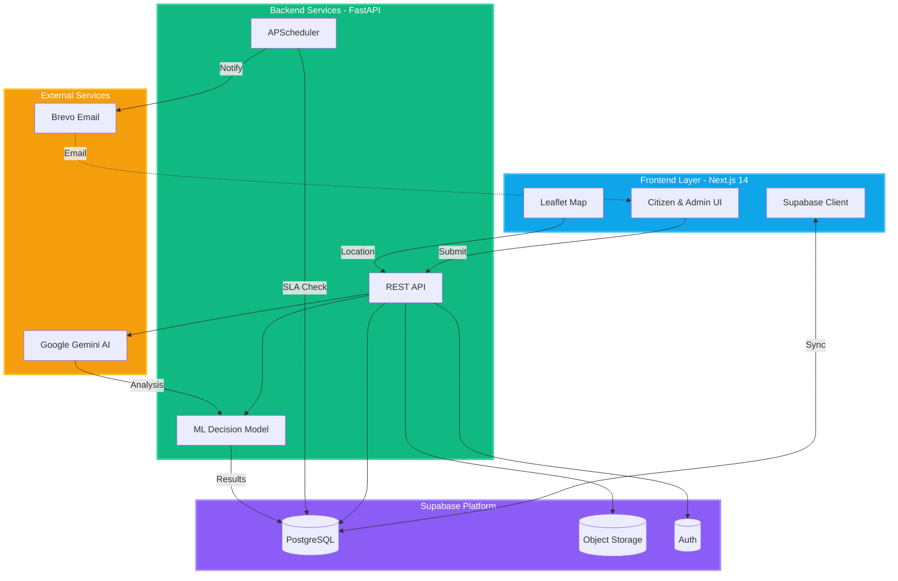

Copyright (c) 2025 This project is licensed under the CC BY-NC-ND 4.0 license. See the LICENSE file for details.

<!-- Frontend -->
[](https://nextjs.org/)
[](https://react.dev/)
[](https://www.typescriptlang.org/)
[](https://tailwindcss.com/)
[](https://ui.shadcn.com/)
[](https://leafletjs.com/)

<!-- Backend -->
[](https://fastapi.tiangolo.com/)
[](https://www.python.org/downloads/release/python-3110/)
[](https://docs.pydantic.dev/latest/)
[](https://apscheduler.readthedocs.io/en/stable/)
[](https://supabase.com/docs/reference/python/introduction)

<!-- AI & Analytics -->
[](https://ai.google.dev/gemini-api)
[](https://scikit-learn.org/stable/)
[](https://shap.readthedocs.io/en/latest/)

<!-- Infrastructure & Services -->
[](https://supabase.com/)
[](https://www.postgresql.org/)
[](https://www.brevo.com/)

# CivicAgent - AI-Powered Civic Engagement Platform

> Give citizens, administrators, and municipal teams a shared, transparent workspace for reporting, triaging, and resolving civic infrastructure issues in real time.

CivicAgent unifies AI-assisted complaint filing, transparent public monitoring, and automated government follow-up into one cohesive platform. Residents can submit issues with photo evidence and precise map coordinates (including autocomplete search), administrators get actionable analytics, and the system takes care of escalations, emails, and SLA tracking.

---

## Table of Contents
- [Overview](#overview)
- [Unique Value Proposition](#unique-value-proposition)
- [Architecture & Workflow](#architecture--workflow)
- [Feature Highlights](#feature-highlights)
- [Tech Stack](#tech-stack)
- [Project Structure](#project-structure)
- [Setup & Installation](#setup--installation)
  - [Prerequisites](#prerequisites)
  - [Backend Setup](#backend-setup)
  - [Frontend Setup](#frontend-setup)
- [Configuration](#configuration)
- [Running Locally](#running-locally)
- [Troubleshooting & Known Issues](#troubleshooting--known-issues)
- [Future Roadmap](#future-roadmap)
- [License](#license)

---

## Overview
CivicAgent is the ByteOrbit Hackarena 2025 submission built to shorten the feedback loop between citizens and municipal departments. It combines a Next.js 14 frontend, FastAPI backend, Supabase persistence, and Google Gemini-based AI services to classify issues, recommend next actions, and keep every stakeholder informed.

The latest sprint introduced:
- Location search with intelligent suggestions before dropping a map pin.
- Streamlined complaint filters and dashboards for advanced public monitoring.
- Hardened schema alignment across Supabase and the application models.
- Navigation improvements (breadcrumbs, back/forward, quick access sidebar) for faster reviews.

---

## Unique Value Proposition
| CivicAgent | Swachhata App | I Make My City |
| --- | --- | --- |
| **AI triage**: Gemini Vision auto-detects categories, severity, and recommended departments. | Manual category selection; limited guidance. | Manual entry; no automated analysis. |
| **Transparency-first**: Public monitoring dashboard with real-time status timeline and SLA tracking. | Status updates limited to reporter; public insight minimal. | Primarily a submission portal without public dashboards. |
| **Autonomous follow-ups**: Scheduler-driven email nudges, escalations, and SLA breach detection. | Requires manual follow-up by complainant. | No automated escalation workflow. |
| **Explainable AI**: SHAP-backed decision model for audit trails and trust. | No AI explainability features. | No AI capability. |
| **Map-first UX**: Hybrid of GPS, manual pinning, and text search with nearby suggestions. | GPS only; hard to correct incorrect coordinates. | Manual text entry only. |

These differentiators produce a citizen experience that feels modern while giving administrators confidence that nothing slips through.

---

## Architecture & Workflow



---

## Feature Highlights
- **Citizen Experience**
  - Guided, multi-step complaint form with AI-generated category suggestions.
  - Leaflet map with GPS auto-detect, manual pin drag, and Nominatim-powered search suggestions.
  - Visual timeline of submission, assignment, and resolution metadata, plus post-resolution feedback.
- **Advanced Public Monitoring**
  - Live metrics by status, category, and SLA compliance available to every visitor.
  - Filterable complaint table with text search, status/category pickers, and quick ID selectors.
  - Responsive layout with consolidated navigation, theme toggle, and back/forward shortcuts.
- **Automation & Intelligence**
  - Google Gemini Vision summarises uploads with confidence scores, detected objects, and severity.
  - APScheduler orchestrates follow-ups, escalations, and email nudges via Brevo.
  - SHAP-powered explanations expose the factors influencing escalation recommendations.

---

## Tech Stack
- **Frontend:** Next.js 14 (App Router), React 18, TypeScript, Tailwind CSS, shadcn/ui, Leaflet.
- **Backend:** FastAPI, Pydantic v2, Supabase Python client, APScheduler.
- **AI & Analytics:** Google Gemini (Vision + Pro), scikit-learn, SHAP.
- **Infrastructure & Services:** Supabase (PostgreSQL + Auth + Storage), Brevo (Sendinblue).

---

## Project Structure
```
ByteOrbit-Hackarena2025/
├── README.md
├── LICENSE
├── backend/
│   ├── app/
│   │   ├── api/                  # REST endpoints
│   │   ├── core/                 # Config and security helpers
│   │   ├── db/                   # Supabase models and client
│   │   ├── schemas/              # Pydantic models
│   │   └── services/             # AI, email, workflow logic
│   ├── database_schema_backend.sql
│   ├── requirements.txt
│   ├── start-backend.ps1
│   └── storage_policies.sql
├── frontend/
│   ├── app/                      # Next.js route groups
│   ├── components/               # UI and feature components
│   ├── lib/                      # Client utilities (Supabase store, config)
│   ├── public/                   # Static assets
│   ├── package.json
│   ├── tailwind.config.ts
│   └── tsconfig.json
├── backend/BACKEND_DOCUMENTATION.md
└── FRONTEND_DOCUMENTATION.md
```

---

## Setup & Installation
### Prerequisites
- Node.js 20.x and npm 10+
- Python 3.11 (required for the backend services)
- Supabase project (PostgreSQL + Auth + Storage) with a public bucket for complaint evidence
- Google Gemini API key with access to Vision and Pro models
- Brevo (Sendinblue) transactional email API key

### Backend Setup
1. **Verify your Python version**
   ```powershell
   python --version
   ```
   Ensure it reports Python 3.11.x. If not, install Python 3.11 before continuing.

2. **Create a virtual environment (choose one method)**
   - **Conda**
     ```powershell
     conda create -n civicagent python=3.11
     conda activate civicagent
     ```
   - **venv (built-in)**
     ```powershell
     python -m venv .venv
     .\.venv\Scripts\activate
     ```
   - **uv (fast Python package manager)**
     ```powershell
     uv venv --python 3.11
     .\.venv\Scripts\activate
     ```

3. **Install backend dependencies**
   ```powershell
   pip install --upgrade pip
   pip install -r backend/requirements.txt
   ```

4. **Apply the database schema and policies (Supabase SQL Editor)**
   - `backend/database_schema_backend.sql`
   - `backend/storage_policies.sql`

### Frontend Setup
```powershell
cd frontend
npm install
```
The frontend expects the backend to be available at `http://localhost:8000` by default.

---

## Configuration
Create environment files before running services.

**Backend `.env`:**
```
SUPABASE_URL=...
SUPABASE_SERVICE_ROLE_KEY=...
GEMINI_API_KEY=...
VISION_MODEL_NAME=gemini-pro-vision
TEXT_MODEL_NAME=gemini-pro
BREVO_API_KEY=...
BREVO_SENDER_EMAIL=...
BREVO_SENDER_NAME=CivicAgent
FRONTEND_URL=http://localhost:3000
BACKEND_URL=http://localhost:8000
```

**Frontend `.env.local`:**
```
NEXT_PUBLIC_SUPABASE_URL=...
NEXT_PUBLIC_SUPABASE_ANON_KEY=...
NEXT_PUBLIC_BACKEND_URL=http://localhost:8000
NEXT_PUBLIC_MAP_DEFAULT_LAT=28.6139
NEXT_PUBLIC_MAP_DEFAULT_LNG=77.2090
```

Add additional secrets such as OAuth credentials if enabling social login.

---

## Running Locally
### Start the Backend
```powershell
cd backend
uvicorn app.main:app --reload --host 0.0.0.0 --port 8000
```
(Activate your virtual environment beforehand if needed.)

### Start the Frontend
```powershell
cd frontend
npm run dev
```
Visit `http://localhost:3000` (or the next available port if 3000 is in use) and sign up for an account to access the authenticated flows. The map search uses the Nominatim public endpoint - keep usage within their fair-use policy.

**Note:** If you see a "Cannot find module" error, delete the `.next` build cache and restart:
```powershell
Remove-Item -Recurse -Force .next
npm run dev
```

---

## Troubleshooting & Known Issues
- **Database mismatch errors:** Re-run `backend/database_schema_backend.sql` and `backend/storage_policies.sql` in Supabase to align columns and RLS policies.
- **AI analysis returning 429 or 5xx:** Gemini APIs enforce quota limits; retry after a short delay or reduce concurrent submissions during demos.
- **Emails not sending:** Ensure the Brevo API key is active and transactional email is enabled for the sender domain.
- **Map search empty:** Nominatim rate-limits aggressively. Reduce rapid searches or self-host the service for production use.
- **Admin stats blank:** Confirm the Supabase service role key is configured and Row Level Security is enabled with the provided policies.

---

## Future Roadmap
- Improve image categorisation accuracy with domain-specific fine-tuning and ensemble techniques.
- Roll out civic intelligence heatmaps and performance metrics to the public monitoring dashboard.
- Expand multilingual support (Hindi and regional languages) across AI prompts and UI copy.
- Add mobile-first offline capture with SMS fallback for low-connectivity zones.
- Introduce two-way department collaboration (comment threads, attachments) and SLA dashboards.

---

## License
This project is distributed under the **Creative Commons Attribution-NonCommercial-NoDerivatives 4.0 International** license.

See [`LICENSE`](LICENSE) for the full legal text.
